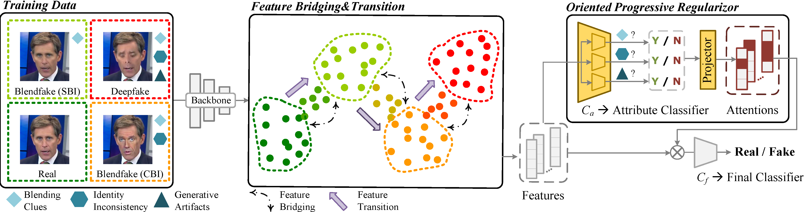

# ProDet
The official code for paper "[Can We Leave Deepfake Data Behind in Training Deepfake Detector](https://arxiv.org/pdf/2408.17052)" (NIPS2024 poster)



ProDet is implemented within the framework of [DeepfakeBench](https://github.com/SCLBD/DeepfakeBench). The provided code should be placed in the corresponding folders in DeepfakeBench, and test/train on DeepfakeBench as well. There is no additional package required beyond DeepfakeBench and this repository, hence you should easily reproduce our paper with an established DeepfakeBench environment as:

`python training/train.py 
--detector_path 
./training/config/detector/prodet.yaml 
--train_dataset 
"FaceForensics++"  
--test_dataset 
"FaceForensics++" "Celeb-DF-v2" "DFDCP" 
`


Completely organized code and instructions will be made available soon. 

You may cite our paper by:  
```bibtex
@article{cheng2024can,
  title={Can We Leave Deepfake Data Behind in Training Deepfake Detector?},
  author={Cheng, Jikang and Yan, Zhiyuan and Zhang, Ying and Luo, Yuhao and Wang, Zhongyuan and Li, Chen},
  journal={arXiv preprint arXiv:2408.17052},
  year={2024}
}

